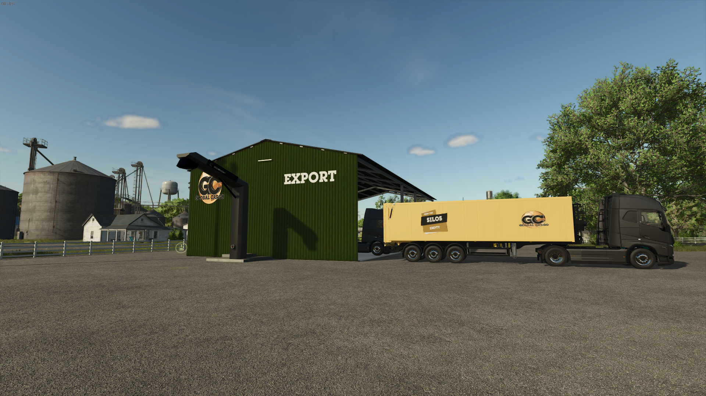

# Do a Export

##What is a export?

An export in farming simulator refers to a farm Manager selling their crops to Global Cargo for distribution to global markets.
Once the export is made, it will be added to a TruckWeb mission, meaning the crops need to be transported via Euro Truck Simulator or American Truck Simulator in order for the farmer to be paid.

## What is in it for me?

As a Contractor, you need to check the amounts of crops and sell them in farming. 
An Export always pays you 5,000 and is usually completed within the hour, making it the easiest way to make money as a contractor. 
Farmers who don’t have their farm on that server can also complete these exports.
Note: Export on a server where you are farm manager are not allowed!

## How does an Export work?

In the Farming-contractor Discord channel, a message is posted whenever a new export is available, or you can check [TrucksWeb](https://trucksweb.globalcargovtc.com/farming/export/overview/) for a list of open exports that can still be done.

Exports are always completed by joining the correct server and the Global Cargo HR Farm.

Steps for completing an export:

1. Before accepting the export, check if you see the correct crop and the right amount (or more) in the export building.
   
   If the crop and quantity are correct, you can accept the export.
2. Drive the required amount of crops to the designated sell point, making sure you're in the Global Cargo HR Farm.
3. If you're working on an export and need to leave suddenly, remember how much you've already transported and keep the export open so you can complete it when you return.( We ask you not to leave the contract open for to long).
4. Once you complete the export, the crops will be transported to our VTC (Virtual Trucking Company) part, and you will get paid for your work.
