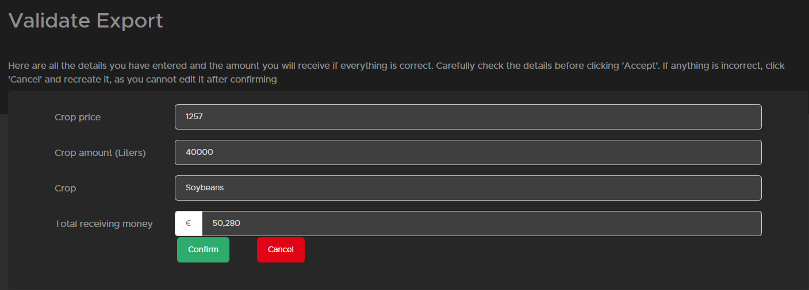

# Create a Export

## how does a export work

Before we are going in to how create a export we first will give a explanation about exports. A export is selling crops to Global Cargo HR on the website you can find the [crop price](https://trucksweb.globalcargovtc.nl/farming/crops-price/) most crops will pay a bit more then in game but not all.
the moment you decide you want to sell your crops as a export you drive your crops to the export building. when everything is in you create a export (explained below how). after that you need to wait till a contractor is coming to check the amounts and sell it in game if thats done it goes in to the next stage.
In this stage everyone in the vtc can help (so no need to be joined in farming as our [ets/ats export](https://trucksweb.globalcargovtc.nl/export) will get new  jobs to drive the moment the jobs of your export are transported by someone (this can be you as well) you will get payed on the website on your farming account.

So you can get a bit more money with exporting and also makes it fun for the vtc as they can help you get your payment but you have to wait a little longer to get your payment mostly. (although when you need to wait in game on the highest price it will cost you some days as well)

## how to create a export

to be honest this is pretty simple.

1. Drive your crop to the export building 
2. [create a export](https://trucksweb.globalcargovtc.nl/farming/create-export) on the site 
3. select the crop you want to sell and the amount (minimal 40.000L and max 400.000L in1 export)
4. after pressing send you will get a confirmation page where you can check all the info (always check if the amount of L is the same as the silo shows)

as you can see above all is showen if you spot a mistake press Cancel and recreate the export if everything is fine you can confirm it and it will be post you can not change it anymore after.
5. then your part is done and you need to wait till the other part are done to receive your money.