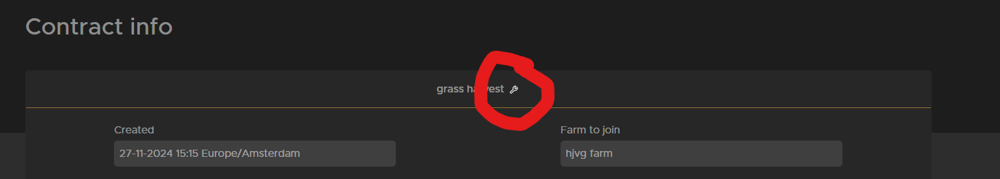
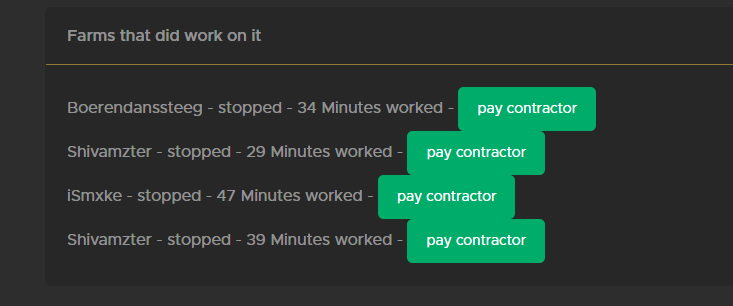
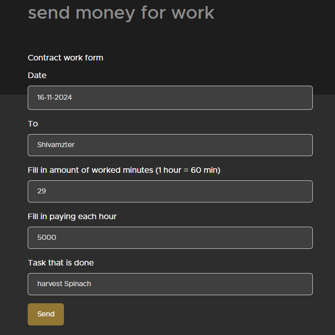

# Create a Contract

## Contracts

Contracts are here to get help on your farm. when you have a lot to do or when your not able to be online that day. Contractors do like to see contracts as thats there way to make money and be able to start there own farm. but also farmers of other servers that have nothing to do or want to make a extra bit of money can do contract.

## how to create a contract

to be honest this is pretty simple.

1. [create a contract](https://trucksweb.globalcargovtc.nl/farming/create-contract) on the site
2. fill in a title that suits the work
3. the amount you want to pay for each hour work (most do 5000)
4. amount of people that could work on it at the same time
5. explain the work that has to be done so its 100% for the contractor what they need to do and where things need to go.
6. by pressing send its posted.

7. you can always edit a contract go to your contract
8. at the top you see a small wrench (behind the title)

watch out the Amount of people that can work on it will jump back to 1

## paying contractor
1. When the work is completed you need to pay the contractor.
2. you go to the contract you posted if you scroll all the way down and you will see the following:

you see the green button to go to the pay overview. Always check comments if a contractor did ad somting somtimes they do forget to stop or start then you need to change the time when paying a bit. If you think the contractor did a really good job your allowd to give them a small bonus.
on this picture you see 3 different contractors/farmers did work for you 1 did stop in between thats why he is 2 times in the list.
3. when pressing the green pay contractor button you will go to the next screen

As you can see all info is filled in automatically so if there was no comment and time is correct you can click send right away.
4. this you need to repeat for every person that did work for you. when you payed them it will look like this

5. when everyone is payed at the top of the contract you can press compleet contract