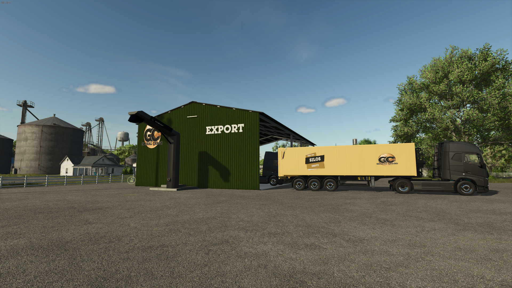

# Een export doen

##Wat is export?

Een export in farming simulator verwijst naar een boerderij manager die zijn gewassen verkoopt aan Global Cargo voor distributie naar wereldwijde markten.
Zodra de export is gemaakt, wordt het toegevoegd aan een TruckWeb missie, wat betekent dat de gewassen moeten worden vervoerd via Euro Truck Simulator of Amerikaanse Truck Simulator om de boer te kunnen betalen.

## Wat zit er voor mij in?

Als Contractor moet je de hoeveelheden gewassen controleren en ze verkopen in farming.
Een Export betaalt je altijd 5.000 en is meestal binnen het uur afgerond, waardoor het de makkelijkste manier is om geld te verdienen als contractor.
Boeren die hun boerderij niet op die server hebben, kunnen deze export ook voltooien.
Opmerking: Exporteren op een server waar je farm manager bent is niet toegestaan!

## Hoe werkt een export?

In het Farming-contractor Discord kanaal wordt een bericht geplaatst wanneer er een nieuwe export beschikbaar is, of je kunt kijken op [TrucksWeb](https://trucksweb.globalcargovtc.com/farming/export/overview/) voor een lijst met open exports die nog gedaan kunnen worden.

Exporten worden altijd voltooid door lid te worden van de juiste server en de Global Cargo HR Farm.

Stappen voor het voltooien van een export:

1. Controleer voordat je de export accepteert of je de juiste uitsnede en de juiste hoeveelheid (of meer) in het exportgebouw ziet.
   
   Als de uitsnede en de hoeveelheid correct zijn, kun je de export accepteren.
2. Rijd de vereiste hoeveelheid gewassen naar het aangewezen verkooppunt en zorg ervoor dat je in de Global Cargo HR Farm bent.
3. Als je bezig bent met een export en plotseling weg moet, onthoud dan hoeveel je al hebt getransporteerd en houd de export open zodat je deze kunt voltooien als je terugkomt (we vragen je om het contract niet te lang open te laten staan).
4. Zodra je de export hebt voltooid, worden de gewassen naar ons VTC-gedeelte (Virtual Trucking Company) vervoerd en krijg je betaald voor je werk.