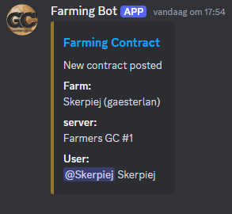
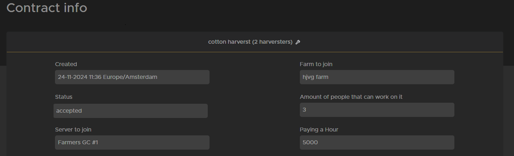

# Doe een contract

## Wat is een contract?

Een contract in farming simulator betekent werk doen voor een andere boer.
Zodra het contract is gemaakt, kun je het accepteren en beginnen met werken als je niet in staat bent om het werk in één keer af te maken. Klik dan op stop met werken en iemand anders kan het werk afmaken of je kunt op een later punt verder gaan.

## Wat zit er voor mij in?

Als loonwerker moet je geld verdienen voordat je je eigen boerderij kunt beginnen.
Het bedrag dat een contract oplevert kan veranderen, maar boeren betalen 5000 voor een uur werk, sommige contracten kunnen meerdere uren duren.
Boeren die hun boerderij niet op die server hebben, kunnen ook helpen met contracten.

## Hoe werkt een contract?

In het Farming-contractor Discord kanaal wordt een bericht gepost wanneer er een nieuw contract beschikbaar is, of je kunt kijken op [TrucksWeb](https://trucksweb.globalcargovtc.com/farming/contract/overview/contracts) voor een lijst met open contracten die nog gedaan kunnen worden.

Op discord kun je eenvoudig op de blauwe Farming Contract tekst klikken om meteen naar het contract te gaan en meer details te zien.

Elk contract zal anders zijn omdat ze gemaakt zijn door de boer en ze zullen je in het contract vertellen wat ze verwachten van de contractant (jou)
Contracten die de status nieuw of geaccepteerd hebben kunnen geaccepteerd worden als het aantal werkende mensen nog niet is bereikt (als iemand op stoppen met werken drukt kan het contract weer aangenomen worden).

De afbeelding hierboven laat zien wanneer het contract is geplaatst, welke boerderij hulp nodig heeft, of het nog nieuw is, geaccepteerd is of wacht op betaling, hoeveel mensen eraan kunnen werken, servernaam en betaling voor een uur werk.
Daaronder staat een uitleg van de boer wat je moet doen en als je helemaal naar de onderkant van de pagina scrollt kun je zien of er nog iemand aan werkt of dat er iemand mee is gestopt.

Als je het contract uitvoert, zorg er dan voor dat je de apparatuur gebruikt van de boerderij die je helpt.

## Stappen voor het voltooien van een contract:

1. Lees het contract om te zien wat er gedaan moet worden zolang het contract niet de status “wacht op betaling” heeft zou het nog steeds beschikbaar moeten zijn.
2. Log in op de server waar het contract voor is geplaatst en voeg je bij de farm die het contract heeft geplaatst.
3. Druk op start werken op Trucksweb wanneer je klaar bent om te beginnen met werken.
4. Als je klaar bent of een lange pauze hebt genomen (meer dan 10 minuten of meerdere pauzes) druk dan weer op stop zodat de boer weet hoelang je gewerkt hebt.
5. Als al het werk klaar is en je hebt op stop gedrukt, kun je op werk voltooid drukken. Als het werk nog niet klaar is, druk je er niet op zodat iemand anders het kan overnemen.
6. Als het werk klaar is zal de boer je zo snel mogelijk betalen en het geld zal worden toegevoegd aan je boerderij account op trucksweb.