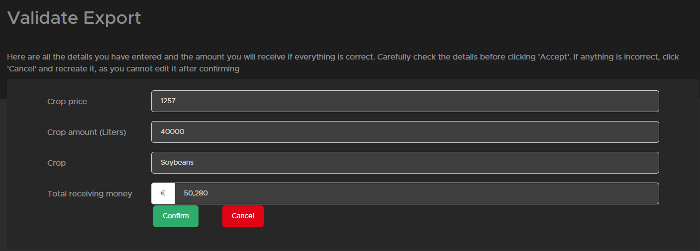

# Een export maken

## Hoe werkt een export?

Voordat we ingaan op hoe je een export maakt zullen we eerst wat uitleg geven over export. Een export is het verkopen van gewassen aan Global Cargo HR op de website kun je de [gewas prijs](https://trucksweb.globalcargovtc.nl/farming/crops-price/) vinden. De meeste gewassen betalen iets meer dan in het spel maar niet allemaal.
Op het moment dat je besluit dat je je gewassen wilt verkopen als export rij je je gewassen naar het export gebouw. als alles binnen is maak je een export aan (hieronder uitgelegd hoe). daarna moet je wachten tot er een contractor komt om de aantallen te controleren en het in het spel te verkopen als dat gedaan is gaat het naar de volgende fase.
In deze fase kan iedereen in de vtc helpen (dus je hoeft niet mee te doen met farming want onze [ets/ats export](https://trucksweb.globalcargovtc.nl/export) krijgt nieuwe jobs om te rijden op het moment dat de jobs van je export door iemand getransporteerd worden (dit kan jij ook zijn) krijg je betaald op de website op je farming account.

Dus je kunt wat meer geld krijgen met exporteren en het maakt het ook leuk voor de vtc omdat ze je kunnen helpen om je betaling te krijgen, maar je moet meestal wat langer wachten om je betaling te krijgen. (hoewel als je in het spel op de hoogste prijs moet wachten, kost het je ook een paar dagen)

## hoe maak ik een export

Om eerlijk te zijn is dit vrij eenvoudig.

1. Drive your crop to the export building
2. [create a export](https://trucksweb.globalcargovtc.nl/farming/create-export) on the site
3. select the crop you want to sell and the amount (minimal 40.000L and max 400.000L in1 export)
4. after pressing send you will get a confirmation page where you can check all the info (always check if the amount of L is the same as the silo shows)
   

   as you can see above all is showen if you spot a mistake press Cancel and recreate the export if everything is fine you can confirm it and it will be post you can not change it anymore after.
5. then your part is done and you need to wait till the other part are done to receive your money.